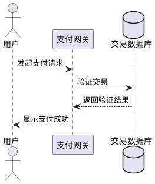

# plantuml snapshot - JAR (~v1.2025.11beta5)
# 为什么要使用PlantUML

在数字时代的洪流中，我们常常被困在繁琐的视觉化工具中——那些需要拖拽、调整、反复修改的绘图软件，不仅耗费时间，更让创意在技术细节中消磨殆尽。想象一下，作为一名开发者或设计师，你正忙于构建一个复杂的系统架构，却不得不停下脚步，手动绘制一张又一张的图表。这不仅是效率的杀手，更是灵感的牢笼。PlantUML的出现，就像一场革命，它用简单的文本代码取代了繁琐的图形界面，让你在敲击键盘的瞬间，就能生成精美的UML图表。矛盾何在？传统工具强调直观，却牺牲了灵活性和版本控制；而PlantUML以代码为核心，不仅提升了协作效率，还让图表成为可追溯、可迭代的资产。选择PlantUML，就是选择从束缚中解放，让思维自由流淌，在代码与视觉的完美融合中，重塑你的工作方式。

# PlantUML是什么

PlantUML是一个基于文本的开源工具，它允许你使用简单的描述性语言来快速生成各种UML图表，如序列图、类图或用例图。无需安装复杂的软件，只需编写几行代码，就能自动转换为清晰的视觉输出，非常适合开发者和文档编写者使用。

# 入门示例

假设你是一家科技公司的软件工程师，正在设计一个在线支付系统的交互流程。传统上，你可能需要花费数小时在绘图工具上调整箭头和框线，但使用PlantUML，你只需在文本编辑器中输入以下代码：

这段代码会立即生成一个清晰的序列图，展示用户从发起请求到支付成功的完整过程。在实际开发中，这样的示例不仅能加速团队沟通，还能通过版本控制系统轻松管理变更，确保文档始终与代码同步。无论是敏捷开发会议还是技术文档编写，PlantUML都能让你的想法以最直观的方式呈现，省时省力，激发创新。

# PlantUML Snapshot - JAR (~v1.2025.11beta5)版本更新了什么

该版本是一个预发布的JAR快照，基于最新开发工作，但不建议用于生产环境。它可能包含了实验性功能或修复，旨在供开发者测试和反馈。具体更新可能涉及性能优化或新图表类型的初步支持，但需谨慎使用以避免不稳定问题。总之，这是一个面向技术爱好者的早期版本，帮助社区共同完善工具。

# 更新日志

## 版本 ~v1.2025.11beta5 更新于 2025-11-21 14:55:49 (UTC)

这是一个 JAR 预发布版本，基于最新开发工作。  
⚠️ **它尚未准备好供一般使用** ⚠️  
⏱ *快照拍摄于 2025-11-21 14:55:49 (UTC)*

# 总结

本次