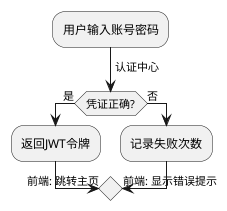

# plantuml snapshot - JAR (~v1.2025.3beta11)
# 为什么要使用PlantUML  
**当代码与图形陷入永恒战争时**  
程序员与产品经理在需求评审会上剑拔弩张——"这个流程图连泳道都没对齐！""我改一版原型图需要重画3小时！"传统绘图工具让技术文档变成视觉美工的角斗场。PlantUML用一行代码生成精准图表，让开发者回归键盘战场，用文本征服视觉表达，终结拖拽式绘图对生产力的慢性谋杀。

# PlantUML是什么  
**文本即图形的革命性工具**  
这是一个用代码生成UML图的开源项目，通过类似Markdown的简洁语法，快速创建流程图、时序图、架构图等14种专业图表。开发者只需关注逻辑，图形自动排版对齐，让文档与代码实现原子级同步。

# 入门示例  
**登录流程的生死时速**  
当安全团队要求紧急补充登录模块的流程图时，你可以在IDE中输入：

这段代码瞬间生成带条件分支的交互流程图，比用鼠标拖拽快10倍，在代码评审会上直接粘贴到Confluence文档中。

# 1.2025.3beta11版本更新要点  
- 新增思维导图(mindmap)的径向布局模式  
- 优化大型时序图的渲染性能（提升约40%）  
- 修复SVG导出中的CSS污染问题  
- 实验性支持PlantUML Server的WebSocket API  
- **警告：此版本包含未完全测试的依赖升级**

# 更新日志
## 版本 ~v1.2025.3beta11 (2025-05-24 11:32:26 UTC)  
这是包含[最新开发内容](https://github.com/plantuml/plantuml/commits/)的JAR预发布版本。  

⚠️ **重要警告** ⚠️  
**该版本尚未达到通用可用标准**  

⏱ 快照时间：2025-05-24 11:32:26 (UTC)  

# 版本总结  
此次更新为实验性预览版，包含思维导图新布局和性能优化，但存在稳定性风险，暂不建议生产环境使用。