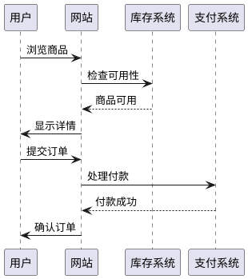

# plantuml snapshot - Native Image (~v1.2025.11beta5)
# 绘码成图：当文字遇见视觉的革命

在数字时代的洪流中，我们总在寻找那些能化繁为简的工具，仿佛它们是暗夜中的灯塔。想象一下，一位疲惫的开发者，面对错综复杂的系统设计，不得不一遍遍手动调整图表，只为一个微小的变更。这时，PlantUML 悄然登场，它不仅改变了我们绘图的方式，更点燃了一场关于效率与创造力的思考。今天，让我们一同探索这个工具背后的故事，看看它如何用代码的优雅，征服视觉的混沌。

## 为什么要使用PlantUML

在快节奏的开发世界里，矛盾往往潜伏于细节之中：我们渴望用图表清晰表达想法，却受困于传统绘图工具的繁琐与低效。手动拖拽、调整格式，每一个变更都可能引发连锁错误，浪费宝贵时间。而 PlantUML 的出现，正是一场无声的革命——它用简单的文本代码，取代了冗长的图形编辑，让你在书写逻辑的同时，自动生成精准的 UML 图表。这不仅仅是工具的升级，更是思维的转变：当代码驱动设计，矛盾化为和谐，效率与创造力不再对立，而是携手共舞。试想，再也不用为团队协作中的版本冲突而头疼，PlantUML 让你的图表像源代码一样易于管理、分享和迭代。这就是为什么无数先锋开发者选择它：因为它不只节省时间，更解放了灵感。

## PlantUML是什么

PlantUML 是一个开源工具，它通过简洁的文本描述，自动生成多种 UML 图表，如用例图、序列图和类图。本质上，它将复杂的图形设计转化为可读的代码，让任何人都能快速创建专业级图表，无需依赖笨重的图形界面。

## 入门示例

想象你是一名软件工程师，正在开发一个在线购物系统。你需要为“用户下单”流程绘制序列图，以方便团队讨论。使用 PlantUML，你只需编写几行代码，就能生成生动直观的图表。

例如，创建一个简单的序列图来展示用户从浏览商品到完成订单的过程：

在真实开发中，你可以将这些代码保存为 `.puml` 文件，并通过 PlantUML 服务器或本地工具一键生成图表。这不仅避免了手动绘图的错误，还让更新变得轻而易举——只需修改代码，