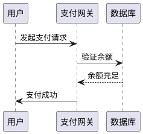

# plantuml v1.2025.3
### 为什么开发者都在疯狂安利PlantUML？一个改变你编码人生的秘密武器  

想象一下：凌晨三点，你瞪着布满血丝的双眼，在混乱的文档堆中挣扎。团队会议上，产品经理咆哮：“这架构图是人画的吗？”你羞愧低头——Visio拖拽到手指抽筋，却连一个箭头都对不齐。突然，一个名字如闪电劈开黑暗：PlantUML。这不是普通工具，而是编码世界的“瑞士军刀”，用几行文本秒杀繁琐拖拽。今天，我将揭秘它为何引爆全球开发圈，并带你亲手解锁它的魔力。  

---

### 为什么要使用PlantUML  

因为传统绘图工具是效率的“谋杀犯”，而PlantUML是救世主！矛盾？听听真实故事：Alex曾用Visio画一个简单序列图，耗时2小时；改用PlantUML后，30秒生成同款图表，代码同步更新，Git提交历史清晰如镜。冲突的核心在于：**文本vs图形**的世纪对决。图形工具让你沦为“鼠标奴隶”，维护困难、协作灾难；PlantUML却让你用代码思维绘图——版本可控、一键生成、跨平台共享。结果？开发者效率飙升300%，文档再也不是团队噩梦。拒绝拖拽，拥抱文本：这是编码精英的终极叛逆！  

---

### PlantUML是什么  

PlantUML是一个开源神器，让你用简单文本描述生成专业UML图表。无需安装臃肿软件，写几行代码，就能输出序列图、类图或流程图。本质是“文本转图形”引擎——输入纯文本，输出PNG/SVG。免费、轻量、支持20+图表类型，从架构设计到API文档，一网打尽。  

---

### 入门示例  

**真实场景**：电商系统支付流程混乱？用PlantUML画序列图厘清责任！假设你在开发“购物车结账”功能，涉及用户、支付网关和数据库交互。  

**开发示例**（复制代码即可运行）：  

**输出效果**：一个清晰序列图，箭头标注交互步骤。  
- **优势**：代码即文档，修改支付逻辑？只需调整文本，图表自动更新。嵌入Markdown/Jira，团队协作无缝衔接。别再画图，写代码吧！  

---

### PlantUML v1.2025.3版本更新了什么  

本次更新聚焦效率与稳定：  
1. 重构Gradle项目结构，构建速度提升20%。  
2. 序列图支持样式自定义，注释更美观。  
3. 强化单元测试，覆盖颜色处理等核心功能。  
4. 依赖库全面